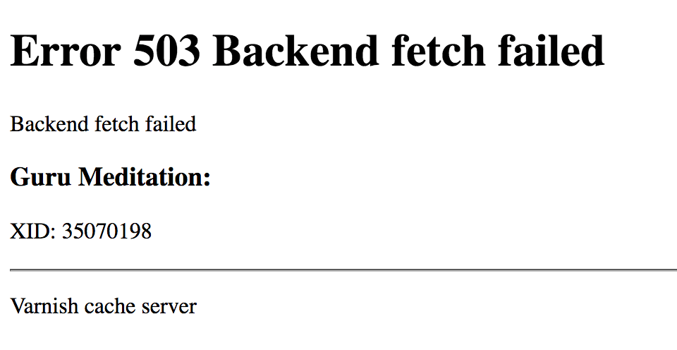

Serving and updating files with VMOD file
=========================================

.. contents:: Table of Contents
   :local:

Generating responses in VCL
---------------------------

We don't think of Varnish as an HTTP or file server. It's a caching
proxy for HTTP, and it should stay that way. Serving content is better
left to the origin servers, from which Varnish fetches and caches
responses.

But in VCL we do have the means to synthesize responses, in which case
Varnish itself generates a response. That's the purpose of the VCL
subroutine ``vcl_synth``, which generates a response body that is
handed off to client delivery. ``vcl_synth`` is used most often, by
far, to generate error responses, for errors determined at the VCL
level, when there is no response from an origin server that could be
used. This could be the result of a failed backend fetch with no
available cached response, or an invalid client request, or a logic
error in VCL, and a myriad of other possibilities.

Error responses are not the only kind of responses that Varnish can
synthesize. In fact, there are some (rather exotic) projects for which
tasks are executed entirely in VCL, and ``vcl_synth`` is used to
generate responses that share the results. One might say that Varnish
is functioning as an HTTP server after all; but we won't explore that
further here.

Returning an error response is quite easy for the VCL developer --
just exit the current flow of execution with ``return(synth(503))`` or
``return(synth(400))`` for a response with status 503 or 400.  The
response status is set to the value in ``synth()``, a client response
is delivered, and the VCL state machine is completed.

There's a bit of a problem, however, when the standard synthetic
response is generated by Varnish's implementation of ``vcl_synth`` in
``builtin.vcl``. The end user sees something like this:

That's it, that's the response. Both users and project managers have
been known to be alarmed to see a site looking like that.

Moreover, a look at the code for builtin ``vcl_synth`` reveals that
maintaining HTML output, even for something as simple as the Guru
Meditation, is not an especially elegant task for VCL::

  sub vcl_builtin_synth {
        set resp.http.Content-Type = "text/html; charset=utf-8";
        set resp.http.Retry-After = "5";
        set resp.body = {"<!DOCTYPE html>
  <html>
    <head>
      <title>"} + resp.status + " " + resp.reason + {"</title>
    </head>
    <body>
      <h1>Error "} + resp.status + " " + resp.reason + {"</h1>
      
"} + resp.reason + {"

      <h3>Guru Meditation:</h3>
      
XID: "} + req.xid + {"

      

      
Varnish cache server

    </body>
  </html>
  "};
  }

The response body is set by assigning a string to ``resp.body``, which
must contain its entire contents. The string here is represented with
special ``{"`` and ``"}`` delimiters, which may contain any content
(including quotation marks) up to the closing delimiter. ``resp.body``
is relatively new in recent versions of VCL; in older versions, the
only way to generate a response was to use the ``synthetic()``
function, with the response body as its string
argument. (``synthetic()`` is still supported.)

Most sites much prefer to have a *custom error response*, more in line
with the sites's design, and nicer to look at than the Guru
Meditation. Origin servers have no problem with that, but errors
encountered in VCL have to be generated in
``vcl_synth``. Better-looking HTML invariably means more HTML, making
the maintenance task even worse if it is embedded in VCL.

For these reasons, it is very convenient to generate responses whose
content is stored in a file. A "nice-looking" HTML file can be
provided by team members who produce the site's HTML already, and VCL
authors wouldn't have to maintain it, a situation that usually makes
both teams much happier.

.. _vmod_std: https://vinyl-cache.org/docs/7.6/reference/vmod_std.html
.. _vmod_file: https://gitlab.com/uplex/varnish/libvmod-file

Reading file contents is not strictly supported by the VCL language,
but it is made possible by VMODs, among them the `std VMOD
<vmod_std_>`_ included in the standard Varnish distribution, and the
third-party `VMOD file <vmod_file_>`_. VMOD file will be the focus of
this tutorial, but first let's look at how it's done in VMOD std.

File reads with the "standard" VMOD
-----------------------------------

Reading file contents with VMOD std is simple enough with the
``std.fileread()`` function::

  sub vcl_synth {
  	# ...
        set resp.body = std.fileread("/path/to/file");
  }

That's all it takes to synthesize a response. ``std.fileread()`` opens
and reads the file on its first-ever invocation, and if successful, it
caches the file's contents and returns them as a string on every
subsequent invocation. That means that the file is only ever read
once.

That might seem like the perfect solution, and for many purposes it
suffices. It means, however, that no changes in the file will ever be
reflected in the returned string. This is true *even when VCL is
reloaded*. The only way to change the contents returned by
``std.fileread()`` is to *restart the Varnish child process*.

This seems very inconvenient, but there are good reasons for
it. Varnish is designed so that, if possible, it is never the cause of
long latency or poor scalability of HTTP requests and responses. That
could be caused by file I/O, so ``std.fileread()`` does the absolute
minimum file system access that is possible.

For a use case such as custom error pages, it may be true that updates
are not necessary very often. Nevertheless, ``std.fileread()`` does
not make it possible to update contents read from a file at all,
without the drastic measure of restarting Varnish.

File reads and updates with VMOD file
-------------------------------------

VMOD file implements file reads with its reader object, which reads
the contents of a file, and periodically checks it for updates in a
background thread::

  import file;

  sub vcl_init {
  	# Check the file for updates once an hour.
  	new rdr = file.reader("/path/to/file", ttl=1h);
  }

  sub vcl_synth {
  	# ...
        set resp.body = rdr.get();
  }

The ``.get()`` method can be used to retrieve the file's contents as a
string in any context. As an alternative for ``vcl_synth``, the
``.synth()`` method may used::

  sub vcl_synth {
  	# ...
        rdr.synth();
  }

The ``.synth()`` method does not return any value. It generates the
synthetic response body, and hence can only be used in ``vcl_synth``.

The ``ttl`` parameter in the constructor, for "time to live"
(re-applying the familiar concept from Varnish's cache), defines an
interval at which the file is checked for changes. This is one of the
ways VMOD file reduces the overhead of file I/O. For the duration of
TTL interval, methods such as ``.get()`` and ``.synth()`` obtain the
file contents when it was last read (similar to ``std.fileread()``'s
solution of caching file contents). Checks for changes, and potential
new file reads, only take place at an interval chosen by the VCL
author.

The impact of file I/O is also excluded from request/response
transactions entirely, because file reads and update checks are
performed in a separate thread. Access methods such as ``.get()`` and
``.synth()`` get the file's contents from its most recent read, but
never invoke any file I/O while Varnish is processing a request.

.. _varnishlog: https://vinyl-cache.org/docs/7.6/reference/varnishlog.html

Because of the fact that checks for changes and file reads are run in
the background, any logging that is emitted while doing so,
particularly error logs, does not appear in the default output of
`varnishlog`_. The default only shows logs for request/response
transactions, but logs for the activity of the background reader only
appear in varnishlog's "raw" grouping. The VMOD's `manual page
<vmod_file_>`_ explains in more detail how to read the VMOD's log
output.

It is possible, however, to determine in VCL if any errors occurred
at the last file check, using the ``.error()`` and ``.errmsg()``
methods::

  import std;
  
  if (rdr.error()) {
  	std.log("file reader error: " + rdr.errmsg());
  }

The ``.error()`` method returns true if there was an error at the last
check, and ``.errmsg()`` returns the error message. If the problem is
fixed by the next check, then afterward ``.error()`` returns false,
and ``.errmsg()`` returns a string indicating that there was no error.

It is possible to invoke a synchronous check of the file for updates,
for example when a new version of the file is available and you really
need to get the new contents right away. The ``.check()`` method does
the same work that the check does in the background does when the TTL
elapses. Except it does so from VCL code, and hence during request
processing.

Obviously it's important to use ``.check()`` carefully; running it
for every request may have an adverse effect on Varnish's
performance. The VMOD's `manual <vmod_file_>`_ shows an example of
calling ``.check()`` in an "admin-only" request with restricted
access; this might be part of an automation that updates the file
and sends a request to bring about timely updates::

  import file;

  if (req.url == "/update-files") {
      # Assume that this ACL defines internal admin networks.
      # Return error status 403 Forbidden if the client IP doesn't
      # match.
      if (client.ip !~ admin_network) {
              return (synth(403));
      }
      # Internal admins may run a synchronous file check.
      rdr.check();
  }

File deletion and update
------------------------

VMOD file was designed to minimize the impact of file I/O on Varnish's
performance. As seen in the previous example, it is also designed with
the assumption that automated processes common at most production
sites are deployed to maintain the file. As we will see, both of these
goals play a role in the way the VMOD handles file deletion and
updates.

.. _mmap(2): https://pubs.opengroup.org/onlinepubs/007904975/functions/mmap.html

The VMOD's method of "caching" file contents is driven by the
performance goal -- the content cache is a memory-mapping of the file
(see `mmap(2)`_). Memory mappings of files are an efficient and low
resource solution on many platforms; but the rules concerning memory
mappings have some nuances worth considering.

One of these is that a file is not unmapped when it is deleted from
the file system. After deletion, a file is no longer accessible by
name, but the mapping persists until it is explicitly
unmapped. Because of this, if a file has been deleted when the VMOD
performs its next background check, it is *not an error*. The file's
contents are still mapped and available to access methods such as
``.get()`` and ``.synth()``.

It is possible, however, to determine in VCL that this has happened,
by using the ``.deleted()`` method::

  import std;

  if (rdr.deleted()) {
  	std.log("File has been deleted, cached contents still valid");
  }

The rules concerning ``mmap(2)`` also affect the guarantees that the
VMOD can make about what happens when the file is changed. There are
subtle differences on different platforms, and some intuitively
"obvious" ways to change a file, such as overwriting it or editing it
in place, don't necessarily have the expected effect in every
environment. This subject is discussed in more detail in the VMOD's
`manual <vmod_file_>`_.

A "portable" guarantee that file updates will work as expected can be
made if they are done in two steps:

* Delete the file.

* Write the new contents to a new file of the same name (same path location).

Of course an automated update process can carry out these two steps.
But it is important to remember to do so if you want to make ad hoc
changes, otherwise the results may be unexpected.

Conditional requests for a file
-------------------------------

.. _conditional requests: https://datatracker.ietf.org/doc/html/rfc9110#name-conditional-requests
.. _304 Not Modified: https://datatracker.ietf.org/doc/html/rfc9110#name-304-not-modified

The VMOD's file object provides methods with information about the
file.  In this section we will see how some of these can be used to
support `conditional requests`_ -- potential validation with response
status `304 Not Modified`_.

The examples thus far have focused on error responses, which in most
cases are not candidates for caching, conditional requests or the 304
response. The following is likely to be useful only if you are using
the VMOD for other purposes. If so, then the VMOD supports some
functions that are commonly expected for static files.

The reader object has a method ``.mtime()``, which returns its most
recent modification time when it was last checked, as a VCL TIME. The
method can be used to implement the semantics of the ``Last-Modified``
and ``If-Modified-Since`` headers::

  import std;

  sub vcl_recv {
        # Return status 304 if If-Modified-Since is earlier than
        # the modification time returned by .mtime().

  	# std.time() parses If-Modified-Since as a TIME. If the parse
  	# fails, fall back to now (which is almost certainly not earlier
  	# than the mtime).
	if (std.time(req.http.If-Modified-Since, now) < rdr.mtime()) {
		return (synth(304));
	}
	else {
		return (synth(200));
	}
  }

  sub vcl_synth {
  	# Always set Last-Modified to the value returned from .mtime().
        # Converting a TIME to a string results in an HTTP date,
        # which is appropriate for Last-Modified.
	set resp.http.Last-Modified = rdr.mtime();

        # Set the response body to the file contents if the status has
        # been set to 200. For status 304, we generate no body.
  	if (resp.status == 200) {
		rdr.synth();
	}
	return(deliver);
  }

The VMOD also provides two methods that return digests for the file
underlying a file object -- ``.id()`` and ``.sha256()``. The ``.id()``
method is available for every object; its contents are derived from
the file's metadata, and is inexpensive to compute. Because of the
potential cost of computing a SHA256 digest, the ``.sha256()`` method
is available only if the ``enable_sha256`` parameter is set to true in
the object constructor::

  import file;
  
  sub vcl_init {
  	new rdr = file.reader("/path/to/file", enable_sha256=true);
  }

SHA256 may be considerably more costly to compute for large files than
the digest returned by ``.id()`` -- see the `manual <vmod_file_>`_ for
further discussion about the differences between the two digest
methods. Since ``.id()`` is entirely suitable for the next example, we
will only consider it here.

.. _vmod_blob: https://vinyl-cache.org/docs/trunk/reference/vmod_blob.html

The values returned by the two digest methods are sutiable for use in
the ``ETag`` response header, and can be compared with a request's
``If-None-Match`` header. The code is very similar to the
implementation of ``Last-Modified`` and ``If-Modified-Since``
above. The main difference is that the digest methods return the BLOB
type, so they need to converted to strings using binary-to-text
encodings from the `blob VMOD <vmod_blob_>`_ in the standard
distribution::

  # Use the base64 encoding of .id() for the ETag response header, and
  # send a 304 response if the If-None-Match request header matches
  # it.

  import blob;

  sub vcl_recv {
	if (req.http.If-None-Match == blob.encode(BASE64, blob=rdr.id())) {
		return (synth(304));
	}
	else {
		return (synth(200));
	}
  }

  sub vcl_synth {
	set resp.http.ETag = blob.encode(BASE64, blob=rdr.id());
  	if (resp.status == 200) {
		rdr.synth();
	}
	return(deliver);
  }

To repeat what was said at the outset -- Varnish is a caching proxy
for HTTP, not an HTTP server. But if your applications of VCL call for
the use of static files for responses (almost as if it were an HTTP
server), then VMOD file can play an important role.
